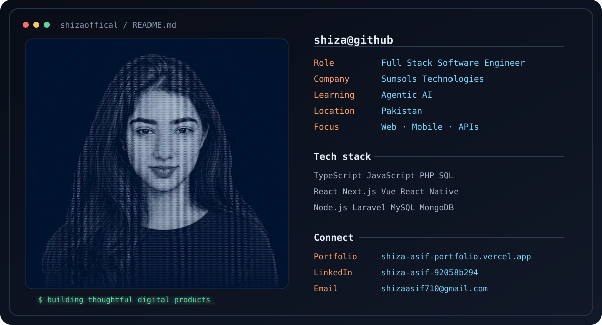

# Hi, I'm Shiza Asif 👋

### Full Stack Software Engineer · Product Builder · Agentic AI Explorer

Designing and building polished web, mobile, backend, and AI-powered products.

  

---

## Technical Toolkit

<table>
<tr>
<td align="center" width="110"> <b>HTML5</b></td>
<td align="center" width="110"> <b>CSS3</b></td>
<td align="center" width="110"> <b>JavaScript</b></td>
<td align="center" width="110"> <b>TypeScript</b></td>
<td align="center" width="110"> <b>React.js</b></td>
<td align="center" width="110"> <b>Next.js</b></td>
<td align="center" width="110"> <b>Angular</b></td>
</tr>
<tr>
<td align="center"> <b>Ionic</b></td>
<td align="center"> <b>Tailwind</b></td>
<td align="center"> <b>Bootstrap</b></td>
<td align="center"> <b>jQuery</b></td>
<td align="center"> <b>PHP</b></td>
<td align="center"> <b>Laravel</b></td>
<td align="center"> <b>Node.js</b></td>
</tr>
<tr>
<td align="center"> <b>MySQL</b></td>
<td align="center"> <b>Firebase</b></td>
<td align="center"> <b>Dart</b></td>
<td align="center"> <b>Flutter</b></td>
<td align="center"> <b>Git</b></td>
<td align="center"> <b>GitHub</b></td>
<td align="center"> <b>GitLab</b></td>
</tr>
<tr>
<td align="center"> <b>Figma</b></td>
<td align="center"> <b>VS Code</b></td>
<td align="center"> <b>Postman</b></td>
<td align="center"> <b>Jira</b></td>
<td align="center"> <b>Slack</b></td>
<td align="center"> <b>Android Studio</b></td>
<td align="center"> <b>Vercel</b></td>
</tr>
</table>

---

## Capability Map

<table>
<tr>
<td width="50%" valign="top">

### 🎨 Frontend Engineering

`Next.js` `TypeScript` `React.js` `Angular`  
`Ionic` `Tailwind CSS` `Bootstrap` `Responsive UI`

</td>
<td width="50%" valign="top">

### ⚙️ Backend Development

`Laravel Advanced` `REST APIs` `Node.js`  
`PHP` `Authentication` `API Integration`

</td>
</tr>
<tr>
<td valign="top">

### 🗄️ Data & Cloud

`MySQL` `Firebase` `Firestore` `phpMyAdmin`  
`Schema Design` `Performance Tuning`

</td>
<td valign="top">

### 🚀 Delivery & Collaboration

`Vercel` `Hostinger` `cPanel` `FileZilla`  
`Postman` `Jira` `Slack` `GitLab`

</td>
</tr>
<tr>
<td valign="top">

### 🤖 AI & Modern Tooling

`GPT` `Claude` `Gemini` `OpenRouter` `Ollama`  
`Cursor` `Codex` `Kiro` `Windsurf` `Cline`

</td>
<td valign="top">

### 📱 Mobile Development

`Dart` `Flutter` `Cross-Platform` `Material Design`  
`Provider` `GetX` `Hive` `sqflite` `SharedPreferences`

</td>
</tr>
</table>

<strong>View complete mobile ecosystem</strong>

 

`Cloud Firestore` · `Firebase Authentication` · `Firebase Storage` · `Firebase Cloud Messaging` · `AdMob Integration` · `REST APIs` · `JSON Parsing` · `Gemini API` · `OpenAI API` · `Android Studio` · `Google Play Console` · `ASO` · `APK / AAB Release`

---

## Current Focus

<table>
<tr>
<td align="center" width="25%">

### 🌐
<strong>Full-Stack Products</strong> 
Complete web experiences

</td>
<td align="center" width="25%">

### 📱
<strong>Mobile Apps</strong> 
Cross-platform delivery

</td>
<td align="center" width="25%">

### 🤖
<strong>Agentic AI</strong> 
Smarter product workflows

</td>
<td align="center" width="25%">

### 🧩
<strong>Clean Architecture</strong> 
Systems built to scale

</td>
</tr>
</table>

---

## GitHub Activity

  

## Let’s build together.

